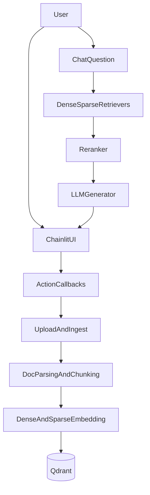

# Architecture

## High-level components

- `src/frontend/app.py`: Chainlit UI entrypoint and action callbacks.
- `src/backend/chatbot/pipeline.py`: retrieval + reranking + generation orchestration.
- `src/backend/chatbot/vector_db_manager.py`: indexing and collection lifecycle management.
- `src/backend/chatbot/collection_metadata_manager.py`: SQLite metadata/facts cache.
- `public/elements/*.jsx`: custom Chainlit frontend elements.

## External dependencies

- Qdrant for vector storage and retrieval.
- Together API-compatible chat generation endpoint.
- DeepInfra API-compatible embedding and reranking endpoints.
- OAuth provider (Authentik-compatible flow) for authentication.

## Data flow

## Trust boundaries

- Browser client to Chainlit server boundary.
- Chainlit server to third-party model providers boundary.
- Chainlit server to Qdrant boundary.
- Local filesystem boundary for uploaded files and metadata DB.

## Security-sensitive surfaces

- OAuth callback flow and token handling.
- Environment variables for provider and DB credentials.
- File upload path handling and collection name sanitization.
- Public-facing action callbacks that mutate state.
